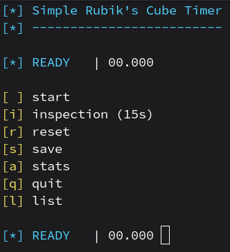

# RubiksCubeTimer

## Description
This python script is a simple Rubik's Cube Timer as a terminal application.

### Keybindings
- space = start
- i = inspection (15s)
- r = reset
- s = save
- a = stats
- q = quit
- l = list
- h = help

### How to execute the script
`python3 timer.py`

## Screenshot

## Requirements
- colorama

## Platform
- Linux
